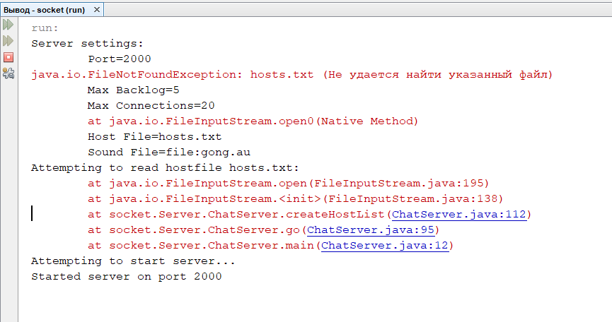
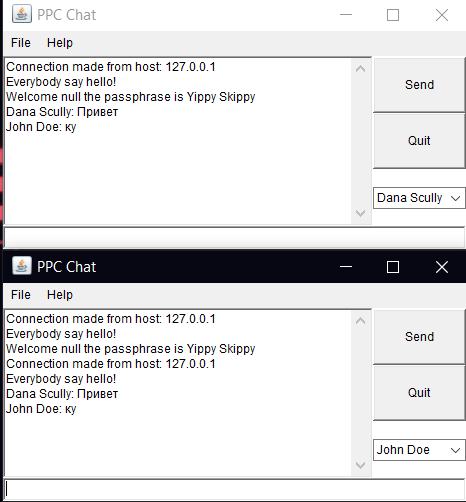

# Створення сокет-клієнта



### Перевірка працездатності сервера та клієнта
1. додайте в проект решту файлів - вміст теки [Server](https://github.com/ppc-ntu-khpi/Sockets-Starter/tree/master/classes/Server)
2. запустіть сервер - клас *ChatServer*. Якщо ви використовуєте Netbeans - правою кнопкою на файлі та обрати пункт *Run File* або натиснути <kbd>Shift</kbd>+<kbd>F6</kbd>. УВАГА! Якщо в консолі ви отримаєте повідомлення про помилки читання чи створення файлу хостів - не звертайте уваги - головне аби серед інших повідомлень ви побачили повідомлення ````Started server on port 2000```` і процес сервера продовжив працювати!
3. запустіть клієнт - клас *ChatClient* тим же способом (<kbd>Shift</kbd>+<kbd>F6</kbd>). В області повідомлень ви маєте побачити магічну фразу😉 від сервера (Yippy Skippy) та повідомлення про з'єднання. УВАГА! Якщо ви отримаєте повідомлення від файрвола Windows - дозвольте вашим програмам доступ до мережі! А краще - взагалі тимчасово вимкнути файрвол!
4. все! можна спілкуватись! Запустіть ще один клієнт (тим же способом) і спробуйте в одному з них відправити якесь повідомлення - ви маєте побачити його в іншому клієнті. УВАГА! Якщо хочете початитись з другом, у пункті 6 вкажіть IP-адресу його машини!